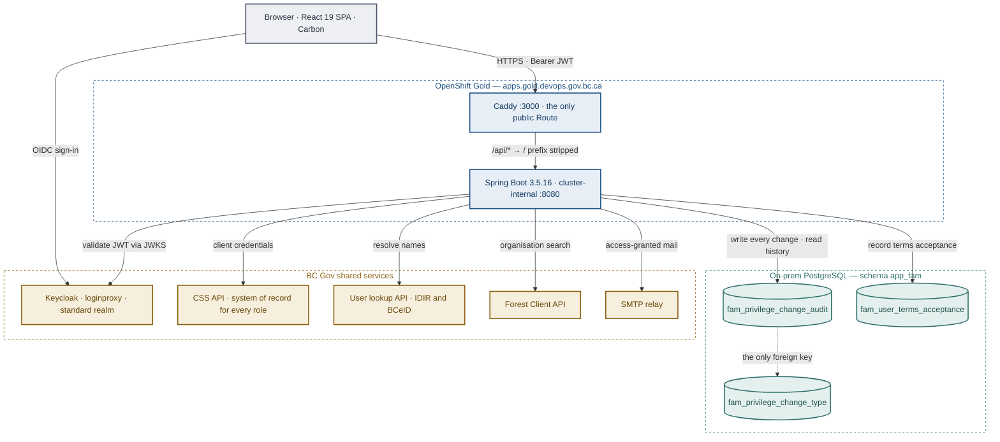

# Two systems of record, and a clean line between them

FAM has no permission model of its own. Every role and every assignment lives in
**BC Gov's Common Hosted Single Sign-On**, reached through the CSS API. What FAM
keeps is what CSS cannot: an append-only record of who changed whose access, and
of which Terms of Use each delegated administrator accepted, in an on-prem
Postgres database.

**React 19** Carbon · Vite  ·  **Spring Boot 3.5.16** Java 21  ·
**OpenShift Gold** apps.gold.devops.gov.bc.ca  ·  **PostgreSQL** on-prem

## Reading the diagram

Ownership is the organising idea, so it gets the colours.

| Colour | What it means |
|---|---|
| **Blue — we deploy it** | Runs in our OpenShift Gold namespace, built and released from this repo. |
| **Teal — our data, elsewhere** | Ours to design and migrate, hosted outside the cluster. No database is deployed here. |
| **Gold — integrated, not owned** | BC Gov shared services. We hold credentials and call them; we do not run them. |



Two of these edges carry the story: everything about *what access exists* goes to
the CSS API, and everything about *how it got that way* goes to Postgres. Nothing
else in the system holds either.

## CSS and the CSS API

### The permission model is a naming convention

CSS stores flat roles. It has no concept of a role that applies only to a
district, a region, or a forest client — so FAM encodes the scope into the role's
name and reads it back out. The name is the only part of a CSS role that FAM
controls, which makes it the whole data model.

```text
Scoped role name
  FSPTS_EDITOR_DISTRICT-DCC
  FSPTS_EDITOR_REGION-CARIBOO
  FSPTS_EDITOR_DISTRICT-DCC_FOREST_CLIENT-00001012

Composite markers, which say a role is scoped at all
  HAS_DISTRICT_ROLE · HAS_REGION_ROLE · HAS_FOREST_CLIENT

Sidecar roles, carrying text CSS has nowhere else to put
  FAM:LABEL:FSPTS_VIEW_ALL:View All
  FAM:DESC:FSPTS_VIEW_ALL:View every FSP without editing
```

Scope segments are written in a fixed order — district, region, forest client —
so the same grant always produces the same name, and a role granted per district
*and* per organisation applies to each pair. The whole name has to fit inside
Keycloak's 255-character limit, which is what bounds how many scopes one grant
can carry.

### What the backend calls

| Endpoint | What it is for |
|---|---|
| `GET /integrations` | The applications FAM administers, and the environments each spans. An "application" in FAM is an integration *plus* an environment. |
| `GET` · `POST` · `DELETE`<br>`/integrations/{id}/{env}/roles` | Reading, defining and removing the roles an application offers, including the label and description sidecars. |
| `/roles/{role}/composite-roles` | Where the scope markers are attached. Reading a role's composites is how FAM knows whether it needs a district, a region or an organisation before it can be granted. |
| `PUT /users/{username}/roles-new` | Assigning roles. One call per user per role: they do not share a fate, and a refusal on one must not discard the grants that already landed. |
| `DELETE /users/{username}/roles/{role}` | Revoking a single assignment. |
| `GET /roles/{role}/users`<br>`GET /users/{username}/roles` | The two directions the screens read: who holds this role, and what does this person hold. |

Authentication is a client-credentials grant against `CSS_TOKEN_URL`, with the
client secret held in an OpenShift Secret and never exposed to the browser. FAM's
own administrative roles live in CSS too, on the integration named by
`CSS_OWN_INTEGRATION_ID` — FAM administers itself through the same API as
everything else.

### Who may appoint whom

Four tiers, held as roles on that same integration: `FAM_ADMIN`, `APP_ADMIN`,
`DELEGATED_ADMIN` and `DEVOPS_ADMIN`. The rule worth writing down is the one that
changed: an application administrator can no longer appoint another application
administrator. That roster is a FAM administrator's to change, in the same way
the DevOps roster already was. Application administrators keep everything else,
including appointing the delegated administrators who do the day-to-day granting.

The check lives in one place — `requireApplicationAdminManagement` — and the
controller applies it to the ordinary grant and revoke paths and to bulk upload
as well as to the appointment screens, because a tier is only as restricted as
its least guarded route.

## The tables

> CSS keeps no history. Ask it who granted a role and when, and there is nothing
> to return — only the current state. The two audit tables exist for exactly that
> gap, and are the reason FAM has a database at all. A third, added later, holds
> the other thing CSS has nowhere to put: a delegated administrator's acceptance
> of the Terms of Use.

### `app_fam.fam_privilege_change_audit`

| Column | What it holds |
|---|---|
| `privilege_change_audit_id` | UUID, defaulted from `gen_random_uuid()`. Rows are written from several pods at once, and an audit identifier that looks like a counter invites being read as a total. |
| `css_integration_id`<br>`css_environment` | Which application the change was made against. It takes both, because a CSS integration spans environments. |
| `css_application_name` | What that application was *called* at the time, e.g. FREP (DEV). A snapshot rather than a reference: an integration removed from CSS used to leave every row about it labelled by a number, which is no answer from a record whose purpose is to outlive the thing it describes. Null on rows written before the column existed, and whenever CSS could not be reached — the name is best effort and never blocks recording the change. |
| `change_date` | When the change happened — deliberately distinct from `create_date`, which is when the row was written. |
| `performer_user`<br>`target_user` | Recorded as `<TYPE>\<GUID>`, e.g. `IDIR\A1B2…`. Not references: FAM stores no user rows, and a grant routinely names somebody who has never signed in. |
| `change_performer_user_details`<br>`change_target_user_details` | JSONB snapshots of who those people were at the time. Copies rather than joins, so the trail stays truthful after a rename. Target resolution is best-effort and never blocks the change it records. |
| `privilege_details` | JSONB. Shape follows the change type: a grant describes the role and its scopes; `DELETE_ROLE` describes the role that was removed and how many people lost it, since CSS keeps no record of a role once it is gone. |
| `privilege_change_type_code` | The table's only foreign key. Everything else is recorded directly, so history cannot be broken by deleting an operational row. |

### `app_fam.fam_privilege_change_type`

Five codes, seeded by the baseline migration: `GRANT`, `REVOKE`, `UPDATE`,
`CREATE_ROLE`, `DELETE_ROLE` — each with the wording the screens show instead of
the code. It carries `effective_date` and `expiry_date` so a retired code still
resolves for the rows written while it was live.

The table is append-only. `update_user` and `update_date` are carried for
consistency with every other table and are expected to stay null — a non-null
`update_user` here is a finding, not a normal state. History is read for one user
within one application, newest first, and the index matches that exactly:
`(css_integration_id, css_environment, UPPER(target_user), change_date DESC)`.

### `app_fam.fam_user_terms_acceptance`

A Business BCeID delegated administrator must accept the Terms of Use before they
can administer anything, and must accept again whenever the terms change. The
roles in CSS can say that somebody *is* a delegated administrator; nothing in CSS
can say that they agreed, when, and to which version. That is a legal record, so
it sits here beside the audit trail rather than on a role attribute somebody
could edit.

| Column | What it holds |
|---|---|
| `accepted_user` | Who accepted, as `<TYPE>\<GUID>` — the same form the audit trail uses, and for the same reason: FAM keeps no user table, and the token is where the identity comes from. |
| `user_name`<br>`business_guid` | Snapshots as at acceptance — the username, and the Business BCeID organisation accepted on behalf of. The terms bind the Subscriber, not only the individual. |
| `terms_version` | Which version was accepted, matching `FamConstants.CURRENT_TERMS_AND_CONDITIONS_VERSION` at the time. Bumping that constant asks everyone again and keeps the record of what they agreed to before. |

Append-only, one row per person per version, enforced by a unique constraint on
`(accepted_user, terms_version)`. No foreign key to a user, for the same reason
the audit has none.

## Deployment

One public route, one private service, no database.

| Area | How it works |
|---|---|
| **Frontend** | Caddy serving the Vite build, with a Coraza WAF and a read-only root filesystem. It holds the namespace's only Route and proxies `/api/*` to the backend Service, stripping the prefix — which keeps the API same-origin and means no CORS in production. |
| **Backend** | Spring Boot as a cluster-internal Service with no Route of its own; it is reachable only through Caddy. Virtual threads are on, and it exposes `health`, `info` and `prometheus` under `/actuator`. |
| **Availability** | Horizontal pod autoscalers on both components, with pod anti-affinity preferring separate nodes. The frontend deliberately has no wait-for-backend init container: a backend outage should not take the SPA down with it. |
| **Database** | On-prem PostgreSQL. This repo deploys no StatefulSet, no Patroni, no Crunchy operator — only a Secret holding the host, port, name and credentials, populated from GitHub environment secrets at deploy time. |
| **Schema** | Flyway migrates `app_fam` on start; Hibernate runs with `ddl-auto: validate`, so the application refuses to boot against a schema the migrations did not produce. |
| **Secrets** | The CSS client secret is backend-only and never reaches the frontend ConfigMap, which the browser fetches. The non-secret CSS settings — URLs, IdP aliases, own integration id — are plain template parameters. |

---

Sources: `backend/openshift.deploy.yml` · `frontend/openshift.deploy.yml` ·
`common/openshift.init.yml` · `frontend/Caddyfile` ·
`backend/src/main/resources/application.yml` ·
`db/migration/V1__baseline.sql` · `V2__audit_application_name.sql` ·
`V3__user_terms_acceptance.sql` · `integration/CssApiService.java` ·
`dto/CssRoleNaming.java` · `security/AuthorizationService.java`
