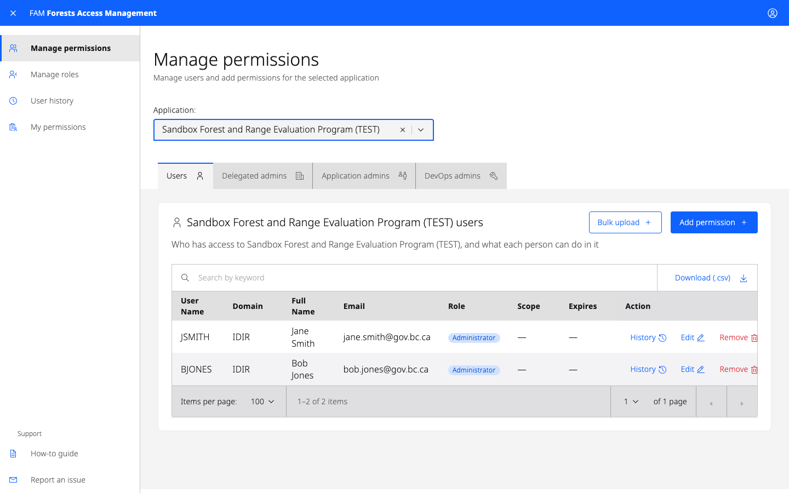
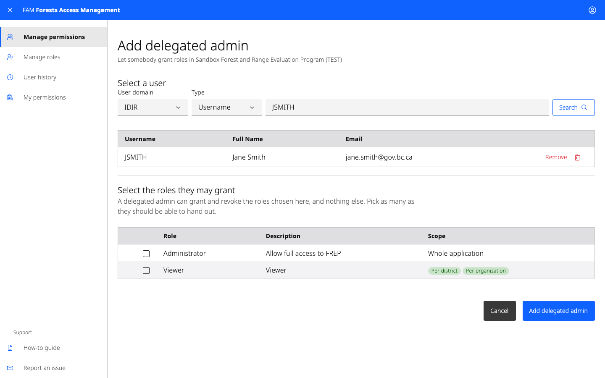
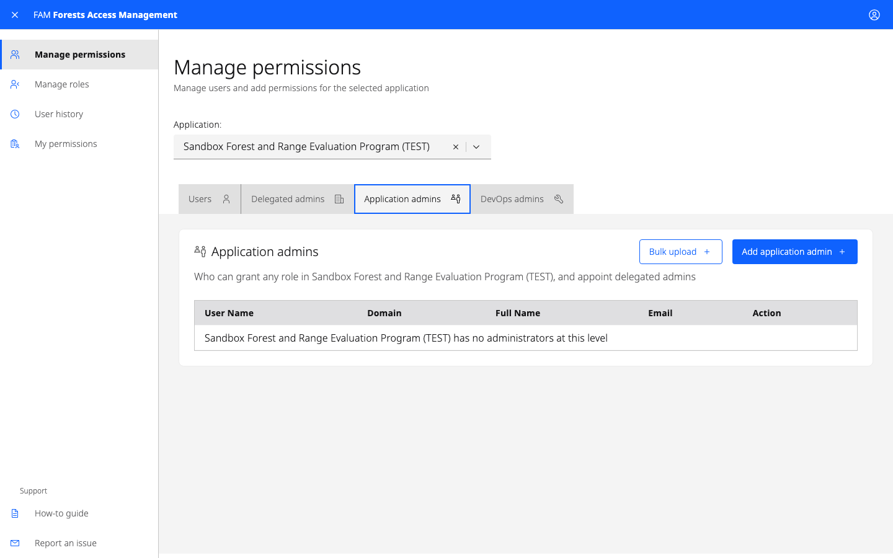
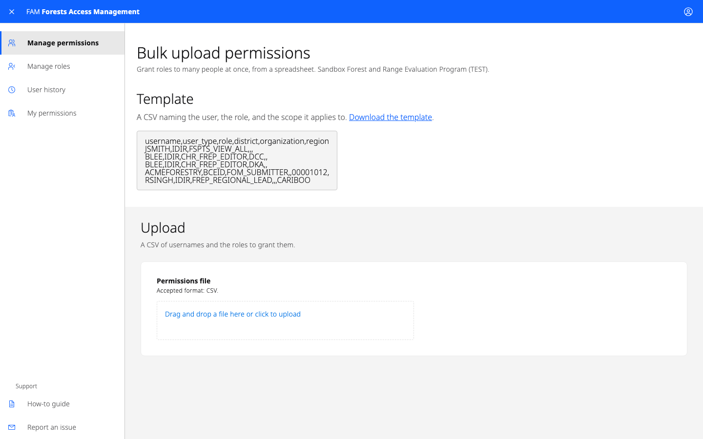
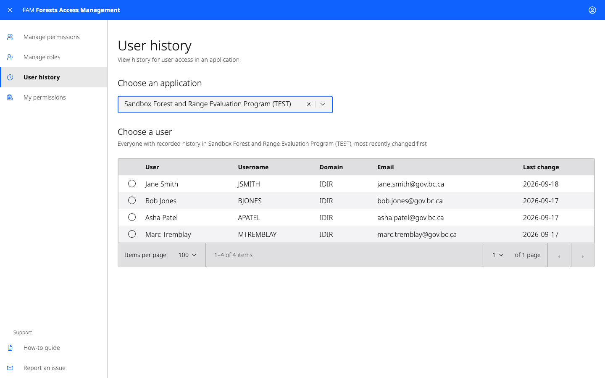

# How to use Forest Access Management (FAM)

A guide for application administrators

Forest Access Management (FAM) is how access to Ministry of Forests applications
is granted and removed. As an application administrator you decide who holds
which roles in your application, and who else may hand those roles out.

For support using FAM, email [Heartwood@gov.bc.ca](mailto:Heartwood@gov.bc.ca).

## Accessing FAM

You need permission before you can use FAM. If you do not have it, email
[Heartwood@gov.bc.ca](mailto:Heartwood@gov.bc.ca).

Once you have access, sign in at
[forestaccess.nrs.gov.bc.ca](https://forestaccess.nrs.gov.bc.ca) with your IDIR.

## Choosing an application

Select the application you want to manage from the **Application** drop-down.
You'll only see the applications you administer.

Each item in the list shows the application name and a coloured pill for the
environment: Development, Test, or Production. Environments are managed
separately, so you need access in each one. Giving someone access in Test does
not give them access in Production.

> **Note:** For security reasons, you can't change your own permissions. If you
> need a role for yourself, ask another administrator to add it.

## The tabs

With an application chosen, the screen offers a tab per kind of access:

| Tab | Who is listed |
| --- | --- |
| Users | Everybody holding a role in the application |
| Delegated admins | People who may grant a subset of those roles to others |
| Application admins | People who administer the application, as you do |
| DevOps admins | People who may define what roles the application has |

## Adding a user's permissions

1. Choose the **Users** tab.
2. Select **Add permission** at the right of the screen.

### Finding the user

1. Choose **IDIR** or **Business BCeID**.
2. Type the person's username in the field and select **Search**.
3. Choose the right person from the results and select **Confirm**.

A surname search can return hundreds of people. Use the filter above the results
to narrow them, and sort by any column heading. Check the username and email
before confirming — they are how you tell two people with the same name apart.

You can select more than one person. Everybody chosen gets the same roles, which
is the quick way to set up a team.

### Choosing the roles

1. Select the roles you want to grant.
2. If a role needs a district, region or organization, choose those as well. Use
   commas to enter several client numbers at once.
3. Set an expiry date if the access should end on a particular day. Leave it
   empty for access that does not expire.
4. Uncheck **Send email to notify user** if you do not want FAM to email them.
5. Select **Grant permission**.

FAM returns you to Manage permissions and confirms what it granted. A grant of
one role to one person names both; a larger one is summarised — "5 roles granted
to 15 users in FREP (TEST)" — rather than listed. If part of it failed, the
banner says so and names what did not go through.

## Reviewing and removing a user's permissions

A permission you have just granted appears at the top of the table with a green
**New** pill.

- To see everything that has happened to somebody's access, select the clock
  icon under the **Action** column.
- To change what they hold, select the edit icon under the **Action** column.
- To take the access away, select the trash can icon under the **Action**
  column and confirm.

## Adding a delegated administrator

A delegated administrator can grant and revoke only the roles you delegate to
them. They cannot appoint other administrators.

Delegated administrators can be internal or external:

- **External** — give someone in an external organization a delegated admin role
  for a specific client number, so they can manage users within their own
  organization.
- **Internal** — give someone in the ministry a delegated admin role for their
  area, for example a district user who manages access for other users in that
  district.

1. Choose the **Delegated admins** tab.
2. Select **Add delegated admin**.
3. Find the person as above.
4. Choose the roles they may hand out. For a scoped role, choose the scope
   values too — delegating Submitter for one district does not let them grant it
   for another.
5. Select **Grant delegated admin**.

### Before appointing a Business BCeID delegated administrator

1. Make sure the Business Profile Manager exists in the BCeID white pages. The
   profile manager is the highest authority in that organization.
2. Appoint a Business BCeID delegated administrator only when the profile
   manager asks for it — either for themselves or for somebody else in their
   organization.
3. Confirm the candidate has been trained on FAM and understands what the role
   carries. They will be asked to accept the terms of use the first time they
   sign in.

## Application administrators

An application administrator has the same authority you do, including appointing
delegated administrators. **Application administrators cannot create new
application administrators.**

The **Application admins** tab shows who administers this application. To have
someone added or removed, email
[Heartwood@gov.bc.ca](mailto:Heartwood@gov.bc.ca) — only a FAM administrator can
change that list.

Application administrators must be IDIR users.

## Bulk user upload

If you have a CSV file with many users to set up — for example, an export from
ADAM — use **Bulk grant** from Manage permissions.

1. Download the template and prepare your CSV. It names the user, the role, and
   the scope it applies to.
2. Upload the CSV.
3. Review what FAM proposes.
4. Apply it.

Rows for access someone already holds are skipped rather than granted again.

## User history

**User history** in the left-hand navigation shows what has happened to one
person's access in an application: what was granted or removed, when, and who
did it.

Choose the application, then the person. The same history is reachable from the
clock icon beside somebody's row on Manage permissions.

## Viewing your own permissions

To see which applications you administer and what roles you hold, select
**My permissions** in the left-hand navigation.

## Getting help

For support using FAM, email [Heartwood@gov.bc.ca](mailto:Heartwood@gov.bc.ca),
or use **Report an issue** in the left-hand navigation.
