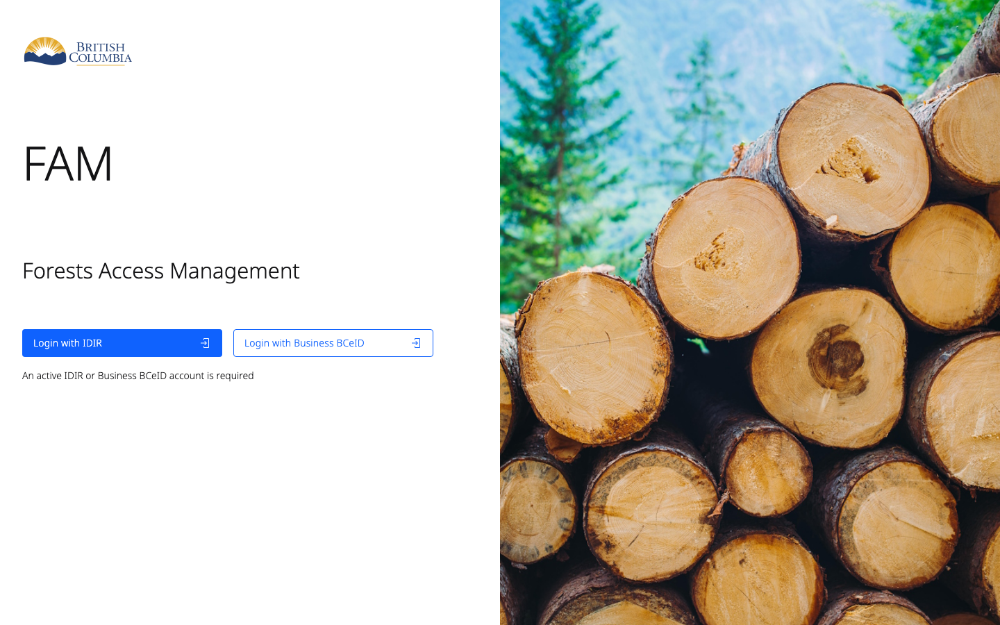
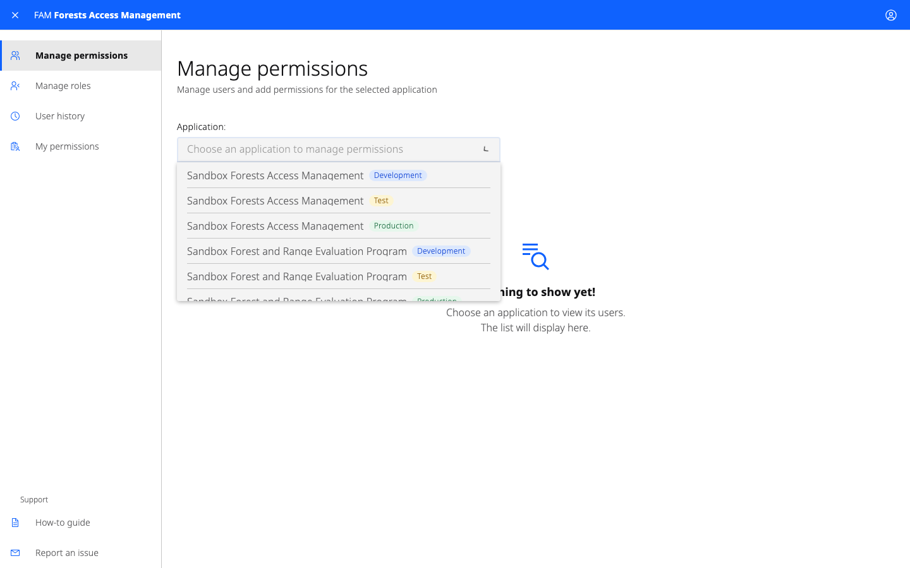
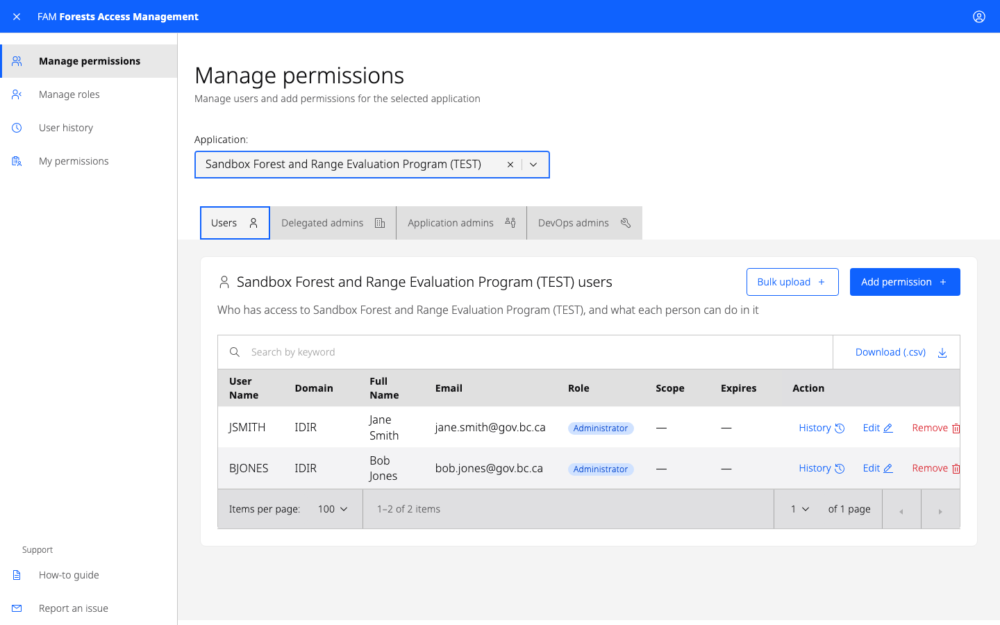
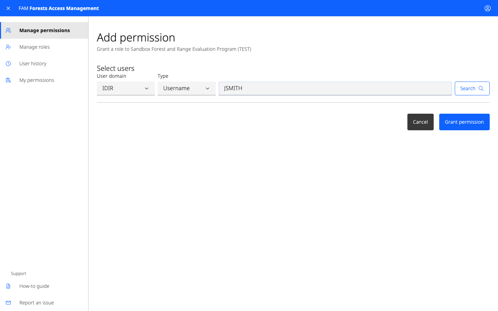
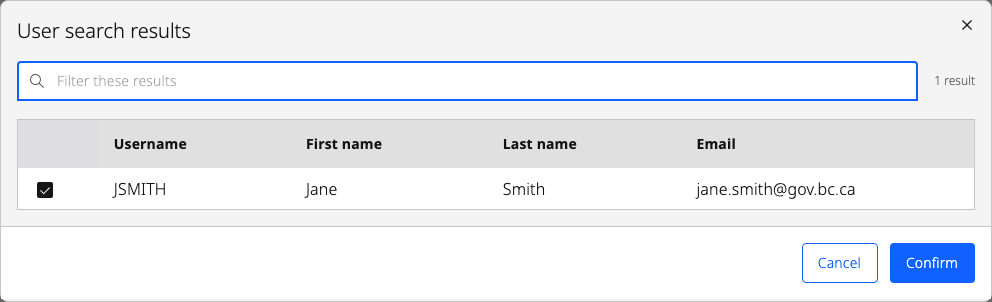
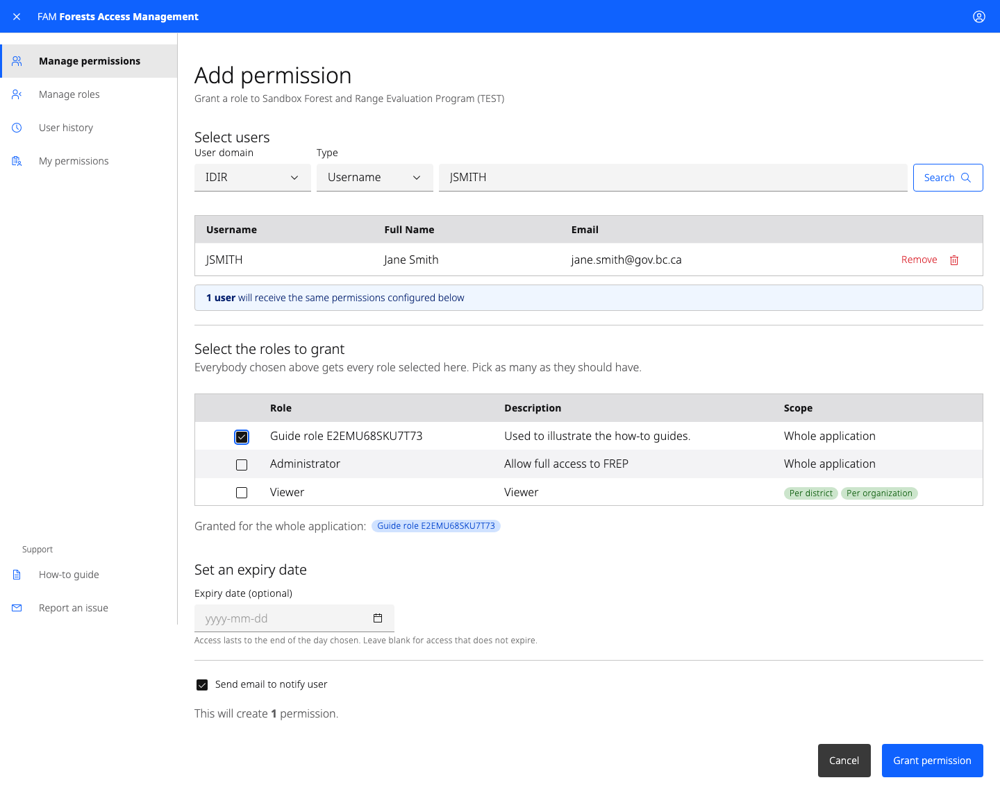
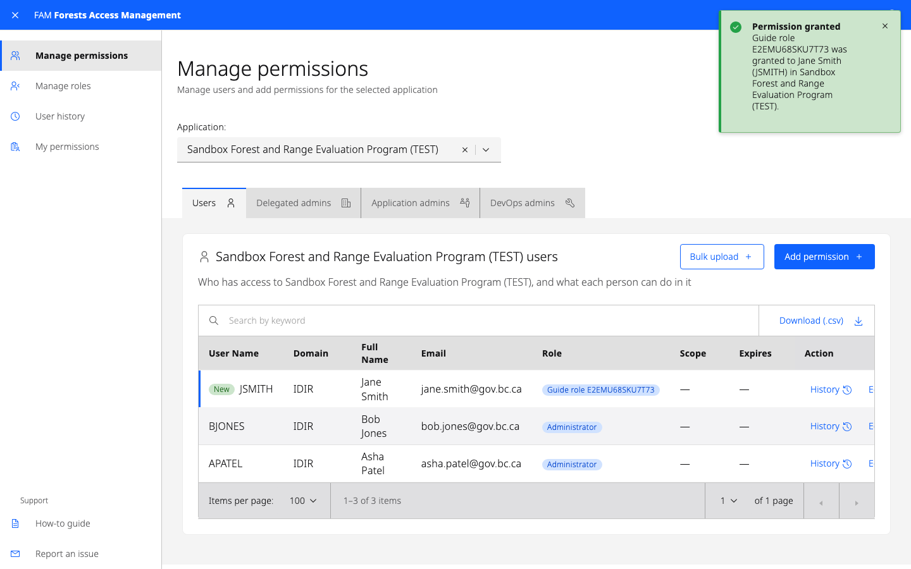
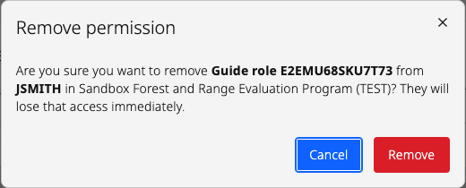
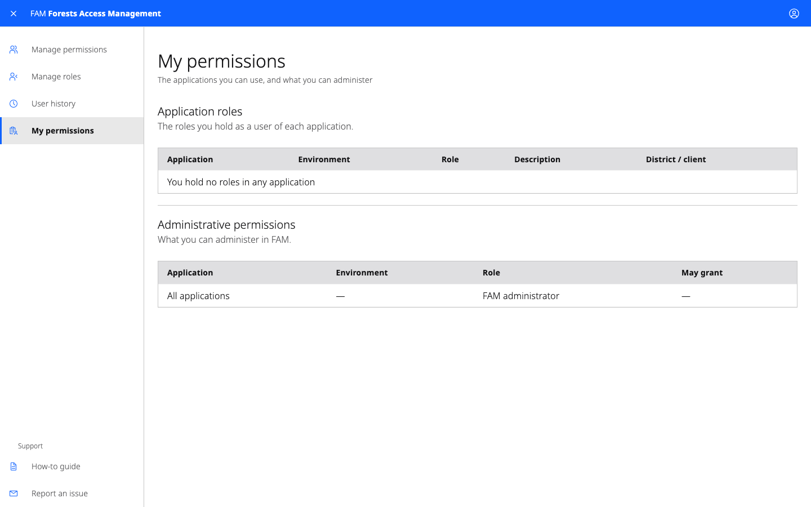

# How to use Forest Access Management (FAM)

A guide for delegated administrators

Forest Access Management (FAM) is how access to Ministry of Forests applications
is granted and removed. As a delegated administrator you give people in your
organization the roles they need in one application, and take them away again
when they no longer need them.

For support using FAM, email [Heartwood@gov.bc.ca](mailto:Heartwood@gov.bc.ca).

## Accessing FAM

You need permission before you can use FAM. If you do not have it, ask the
application's administrator, or email
[Heartwood@gov.bc.ca](mailto:Heartwood@gov.bc.ca).

Once you have access, sign in at
[forestaccess.nrs.gov.bc.ca](https://forestaccess.nrs.gov.bc.ca) with your Business BCeID.

### Accepting the terms of use

The first time you sign in as a delegated administrator, FAM shows the terms of
use and asks you to accept them. You cannot manage access until you do. If the
terms change later, you are asked again.

## Choosing an application

Select the application you want to manage from the drop-down at the top of
Manage permissions. Only applications you can grant access to appear in the
list.

Each entry shows the application's name and a pill naming the environment:
Development, Test or Production. These are separate: granting somebody access in
Test does not give them access in Production.

You cannot change your own permissions. Ask another administrator if you need a
role yourself.

## Adding a user's permissions

1. With your application selected, choose the **Users** tab.
2. Select **Add permission** at the right of the screen.

### Finding the user

1. Type the person's Business BCeID username in the field.
2. Select **Search**.
3. Choose the right person from the results and select **Confirm**.

Only people within your own organization are returned. If you search for
somebody at another business, FAM tells you so rather than showing you their
details.

The search returns everyone matching what you typed, which for a common surname
can be hundreds of people. Use the filter above the results to narrow them, and
sort by any column heading. Check the username and email before confirming —
they are how you tell two people with the same name apart.

### Choosing the roles

1. Select the roles you want to grant. You can grant more than one at a time.
2. If a role needs a district, region or organization, choose those as well. Use
   the search box to find an organization by name or client number.
3. Set an expiry date if the access should end on a particular day. Leave it
   empty for access that does not expire.
4. Uncheck **Send email to notify user** if you do not want FAM to email them.
5. Select **Grant permission**.

FAM returns you to Manage permissions and confirms what it granted.

## Reviewing a user's permissions

A permission you have just granted appears at the top of the table, marked with
a green **New** pill, so you can see what you did without hunting for it.

To see everything that has happened to somebody's access, select the clock icon
under **Action** at the right of their row.

## Removing a user's permissions

1. Select the application from the drop-down.
2. Find the person in the table. The search box above it matches names,
   usernames, emails, roles and scopes.
3. Select the trash can icon under **Action** at the right of their row.
4. Confirm the removal.

FAM confirms when the access has been removed.

## Viewing your own permissions

To see which applications you can administer and what you have been delegated,
select **My permissions** in the left-hand navigation.

## Getting help

For support using FAM, email [Heartwood@gov.bc.ca](mailto:Heartwood@gov.bc.ca),
or use **Report an issue** in the left-hand navigation.
